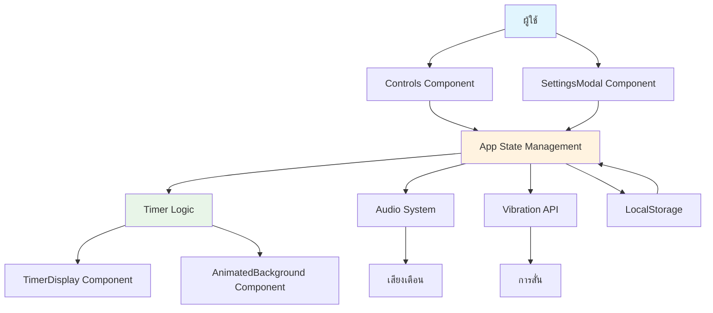

# Simple Pomodoro Thai 🍅

> ตัวจับเวลาพอมอดอโรแบบง่ายสำหรับผู้ใช้ภาษาไทย

[](https://reactjs.org/)
[](https://www.typescriptlang.org/)
[](https://vitejs.dev/)
[](https://opensource.org/licenses/MIT)

## สารบัญ 📋

- [ภาพรวมโปรเจกต์](#ภาพรวมโปรเจกต์)
- [ฟีเจอร์หลัก](#ฟีเจอร์หลัก)
- [ความต้องการของระบบ](#ความต้องการของระบบ)
- [คำแนะนำการติดตั้ง](#คำแนะนำการติดตั้ง)
- [วิธีการใช้งาน](#วิธีการใช้งาน)
- [สถาปัตยกรรมระบบและการไหลของข้อมูล](#สถาปัตยกรรมระบบและการไหลของข้อมูล)
- [การแก้ปัญหาและคำถามที่พบบ่อย](#การแก้ปัญหาและคำถามที่พบบ่อย)
- [แผนงานในอนาคต](#แผนงานในอนาคต)
- [ใบอนุญาต](#ใบอนุญาต)
- [ผู้พัฒนาและเครดิต](#ผู้พัฒนาและเครดิต)

## ภาพรวมโปรเจกต์ 📖

Simple Pomodoro Thai เป็นเว็บแอปพลิเคชันตัวจับเวลาพอมอดอโรแบบเรียบง่ายที่พัฒนาโดยใช้ React และ TypeScript แอปพลิเคชันนี้ช่วยให้ผู้ใช้จัดการเวลาในการทำงานและพักผ่อนอย่างมีประสิทธิภาพตามเทคนิค Pomodoro ซึ่งเป็นวิธีการบริหารเวลาแบบหนึ่งที่แบ่งเวลาเป็นช่วงสั้นๆ

แอปพลิเคชันนี้รองรับภาษาไทยอย่างสมบูรณ์ พร้อมด้วยอินเทอร์เฟซที่สวยงาม มีพื้นหลังเคลื่อนไหว และระบบเสียงเตือนที่หลากหลาย ผู้ใช้สามารถปรับแต่งเวลาทำงานและเวลาพักผ่อนได้ตามความต้องการ รวมถึงเปิด/ปิดเสียงและเลือกประเภทเสียงที่ต้องการ

## ฟีเจอร์หลัก ✨

- ⏱️ **ตัวจับเวลาพอมอดอโร**: ระบบจับเวลาทำงาน 25 นาที และพักผ่อน 5 นาที (ปรับแต่งได้)
- 🎵 **เสียงเตือนหลากหลาย**: เลือกจากเสียงมากกว่า 10 ประเภท รวมถึงเสียงคลาสสิก เบลล์ ดิจิทัล และอื่นๆ
- 📱 **รองรับมือถือ**: ออกแบบให้ใช้งานได้สะดวกบนอุปกรณ์ทุกขนาด
- 🎨 **พื้นหลังเคลื่อนไหว**: ภาพเคลื่อนไหวที่เปลี่ยนแปลงตามโหมดทำงาน/พักผ่อน
- ⚙️ **การตั้งค่าที่ยืดหยุ่น**: ปรับแต่งเวลา ความดังเสียง และประเภทเสียงได้
- 📊 **ติดตามเซสชัน**: นับจำนวนเซสชันที่ทำงานเสร็จสิ้น
- 💾 **บันทึกการตั้งค่า**: เก็บการตั้งค่าลงในเบราว์เซอร์อัตโนมัติ
- 📳 **การสั่นเตือน**: สั่นเตือนเมื่อเวลาหมด (รองรับอุปกรณ์ที่รองรับ)

## ความต้องการของระบบ 🖥️

### ข้อกำหนดขั้นต่ำ
- **ระบบปฏิบัติการ**: Windows 10+, macOS 10.15+, Linux (Ubuntu 18.04+)
- **เบราว์เซอร์**: Chrome 90+, Firefox 88+, Safari 14+, Edge 90+
- **หน่วยความจำ**: 512 MB RAM ขั้นต่ำ (แนะนำ 1 GB)
- **พื้นที่เก็บข้อมูล**: 10 MB สำหรับการติดตั้ง

### ไลบรารีและ Dependencies
- React 19.2.0+
- TypeScript 5.8.2+
- Vite 6.2.0+
- Node.js 18.0.0+ (สำหรับการพัฒนา)

## คำแนะนำการติดตั้ง 🚀

### การติดตั้งจาก Source Code

1. **โคลน Repository**
   ```bash
   git clone https://github.com/your-username/simple-pomodoro-thai.git
   cd simple-pomodoro-thai
   ```

2. **ติดตั้ง Dependencies**
   ```bash
   npm install
   ```

3. **รันในโหมดพัฒนา**
   ```bash
   npm run dev
   ```

4. **เปิดเบราว์เซอร์** และไปที่ `http://localhost:5173`

### การ Build สำหรับ Production

```bash
npm run build
```

ไฟล์ที่ Build เสร็จแล้วจะอยู่ในโฟลเดอร์ `dist/`

### การ Preview Build

```bash
npm run preview
```

## วิธีการใช้งาน 📱

### การเริ่มใช้งานเบื้องต้น

1. **เปิดแอปพลิเคชัน** ในเบราว์เซอร์
2. **คลิกปุ่ม Play** เพื่อเริ่มจับเวลา
3. **ทำงาน** ตามเวลาที่กำหนด (ค่าเริ่มต้น 25 นาที)
4. **เมื่อเวลาหมด** แอปจะสั่นและเล่นเสียงเตือน
5. **พักผ่อน** เป็นเวลา 5 นาที หรือปรับแต่งตามต้องการ

### การปรับแต่งการตั้งค่า

1. **คลิกไอคอน Settings** (⚙️) ที่มุมขวาบน
2. **ปรับแต่งเวลา** ทำงานและพักผ่อน
3. **เลือกเสียงเตือน** จากรายการที่มี
4. **ปรับความดัง** ของเสียง
5. **เปิด/ปิดเสียง** ตามต้องการ

### การควบคุมตัวจับเวลา

- **▶️ Play/Pause**: เริ่มหรือหยุดตัวจับเวลา
- **🔄 Reset**: รีเซ็ตเวลากลับไปเริ่มต้น
- **🔄 Switch Mode**: สลับระหว่างโหมดทำงานและพักผ่อนด้วยตนเอง

## สถาปัตยกรรมระบบและการไหลของข้อมูล 🏗️

### โครงสร้างโค้ด

```
simple-pomodoro-thai/
├── components/           # คอมโพเนนต์ UI
│   ├── AnimatedBackground.tsx    # พื้นหลังเคลื่อนไหว
│   ├── Controls.tsx              # ปุ่มควบคุม
│   ├── SettingsModal.tsx         # หน้าต่างตั้งค่า
│   └── TimerDisplay.tsx          # แสดงตัวจับเวลา
├── utils/               # ยูทิลิตี้
│   └── audio.ts         # จัดการเสียง
├── types.ts             # นิยามประเภทข้อมูล
├── App.tsx              # คอมโพเนนต์หลัก
└── index.tsx            # จุดเริ่มต้นแอป
```

### การไหลของข้อมูล



**คำอธิบายการไหลของข้อมูล:**

1. **การโต้ตอบของผู้ใช้**: ผู้ใช้โต้ตอบผ่าน Controls และ SettingsModal
2. **การจัดการสถานะ**: App.tsx จัดการสถานะหลักทั้งหมด (ตั้งค่า, โหมด, เวลา)
3. **ตรรกะตัวจับเวลา**: useEffect จัดการการนับถอยหลังและการเปลี่ยนโหมด
4. **การแสดงผล**: TimerDisplay และ AnimatedBackground แสดงผลตามสถานะปัจจุบัน
5. **การแจ้งเตือน**: ระบบเสียงและการสั่นทำงานเมื่อเวลาหมด
6. **การเก็บข้อมูล**: การตั้งค่าถูกบันทึกใน LocalStorage อัตโนมัติ

### แนวคิดการออกแบบ

- **Component-Based Architecture**: ใช้ React Hooks และ Context สำหรับการจัดการสถานะ
- **Responsive Design**: ออกแบบให้ปรับขนาดตามอุปกรณ์
- **Progressive Enhancement**: ทำงานได้แม้ไม่มีเสียงหรือการสั่น
- **Accessibility**: รองรับการใช้งานด้วยคีย์บอร์ดและ Screen Reader

## การแก้ปัญหาและคำถามที่พบบ่อย 🔧

### ปัญหาทั่วไป

**Q: เสียงไม่ดังหรือไม่เล่น**
A: ตรวจสอบว่าคุณเปิดเสียงในเบราว์เซอร์แล้ว และปรับระดับเสียงในแอปให้สูงขึ้น

**Q: แอปไม่ทำงานบนเบราว์เซอร์บางตัว**
A: แอปนี้รองรับเบราว์เซอร์สมัยใหม่ ลองอัปเดตเบราว์เซอร์หรือใช้ Chrome/Firefox

**Q: การตั้งค่าหายไปหลังปิดเบราว์เซอร์**
A: การตั้งค่าถูกเก็บใน LocalStorage หากลบข้อมูลเบราว์เซอร์ การตั้งค่าจะหายไป

**Q: ไม่มีเสียงสั่นบนอุปกรณ์บางตัว**
A: การสั่นรองรับเฉพาะอุปกรณ์ที่รองรับ Vibration API (มือถือสมัยใหม่ส่วนใหญ่)

**Q: แอปทำงานช้า**
A: ลองเคลียร์แคชเบราว์เซอร์หรือรีสตาร์ทเบราว์เซอร์

### การแก้ปัญหา Environment

**การติดตั้ง Node.js**
```bash
# ตรวจสอบเวอร์ชัน Node.js
node --version

# หากไม่มี ติดตั้งจาก https://nodejs.org/
```

**การแก้ปัญหา Dependencies**
```bash
# ลบ node_modules และติดตั้งใหม่
rm -rf node_modules package-lock.json
npm install
```

## แผนงานในอนาคต 🚀

- [ ] **โหมดมืด/สว่าง**: เพิ่มการสลับธีม
- [ ] **สถิติการใช้งาน**: แสดงกราฟและสถิติการทำงาน
- [ ] **การแจ้งเตือนเดสก์ท็อป**: แจ้งเตือนแม้ไม่ได้เปิดแอป
- [ ] **การซิงค์ข้ามอุปกรณ์**: ซิงค์การตั้งค่าผ่านคลาวด์
- [ ] **ภาษาเพิ่มเติม**: รองรับหลายภาษา
- [ ] **PWA Support**: ติดตั้งเป็นแอปเนทีฟ
- [ ] **การปรับแต่งธีม**: เปลี่ยนสีและฟอนต์ได้

## ใบอนุญาต 📄

โปรเจกต์นี้ใช้ใบอนุญาต MIT - ดูรายละเอียดได้ที่ [LICENSE](LICENSE) file

## ผู้พัฒนาและเครดิต 👥

**ผู้พัฒนาหลัก**: ธีร์ คานาโอะ

**เทคโนโลยีที่ใช้**:
- React - UI Framework
- TypeScript - Type Safety
- Vite - Build Tool
- Tailwind CSS - Styling (ถ้ามี)#

